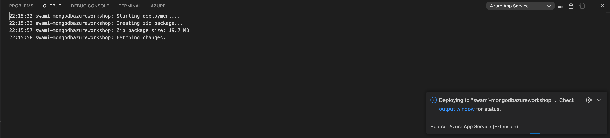

# MongoDB Atlas Azure App Service workshop

## 1. Creating Azure App service from Azure portal

### 1.1 Search for webapp in `Azure search panel` on the top


### 1.2 Click on `Create` drop down and click on `WebApp`


### 1.3 Create new resource group for the `web app`


### 1.4 Choose an unique name, runtime stack and OS

* Choose an unique name `prefix your name to make the DNS globally unique`
* Choose `Pubish` as `Code`
* Choose `Runtime stack` as `.NET 6(LTS)`
* Choose `Operating System` as `Linux`
* Choose `Region` as `Central India`
* Click on Deployment


### 1.5 Choose App service plan


### 1.6 Choose Deployment options

* Leave the Continuous deployment as `Disable`
* Click on `Networking`


### 1.7 Choose Networking options

* Leave the default selection `as-is` and click `Monitoring`


### 1.8 Choose Monitoring options

* Disable `Application Insights` _Only for demo purposes_
* Click on `Tags`

    

### 1.9 Create tags


### 1.10 Review and Create

* Click on Review + Create


### 1.11 Monitor Deployment progress


### 1.12 Deployment Notification


## 2. Setting up VS Code with Azure Tools Extension

### 2.1 Install `Azure Tools extension in VS Code`


### 2.2 Sign in to Azure

#### 2.2.1 Sign in 


#### 2.2.2 Pick Azure Login


#### 2.2.3 Azure login confirmation in the browser


#### 2.2.4 Signed in View in `VS Code`


## 3. Deploying dotnet app from VSCode to Azure App service

### 3.1 Publish the dotnet app into local folder

To publish the application, Navigate to the folder from the `terminal` or `command prompt` where `.csproj` file is present  run the below command  

```dotnet publish -o /.publish```

You should see a new `publish` folder created alongside other folders which will contain the published DLLs

### 3.2 Deploy the publish folder to Azure app service

#### 3.2.1 Right click on the `publish` folder and click `Deploy to webapp`


#### 3.2.2 Choose the Azure app service that was created in step `1`


#### 3.2.3 Provide confirmation for deployment


#### 3.2.4 Monitor the deployment progress in `output` window

* Monitor deployment



#### 3.2.5 Browse to the web app once deployment is done 


`Allow access from ALL network in MongoDB Atlas to enable access to the DB from Azure` - **ONLY for Demo purpose, this is strictly prohibited for production workloads**


# Bonus exercises

## Setting up continuous deployment from Azure Portal

## Reading the secrets from Azure Key Vault

